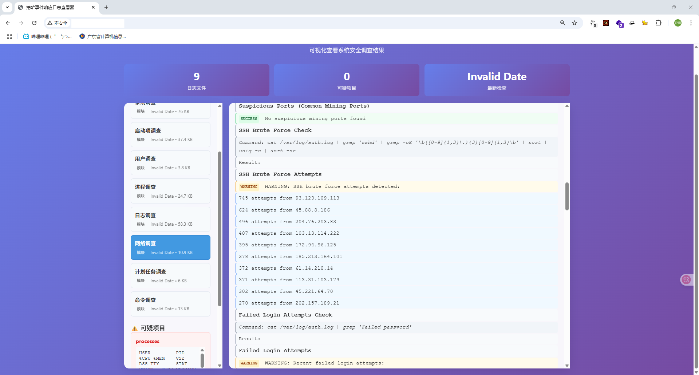

# 挖矿事件响应脚本 (Mining Incident Response Script)

一个专为Ubuntu系统设计的挖矿事件响应脚本，用于快速检测和分析可能的挖矿恶意软件活动。

## 文件结构

```
ERS/
├── mining_incident_response.sh    # 主脚本
├── web_viewer.py                  # Web查看器
├── start_web_viewer.sh           # Linux Web查看器启动脚本
├── start_web_viewer.bat          # Windows Web查看器启动脚本
├── modules/                       # 调查模块
│   ├── user_investigation.sh     # 用户调查
│   ├── command_investigation.sh  # 命令调查
│   ├── network_investigation.sh  # 网络调查
│   ├── process_investigation.sh  # 进程调查
│   ├── startup_investigation.sh  # 启动项调查
│   ├── cron_investigation.sh     # 计划任务调查
│   ├── log_investigation.sh      # 日志调查
│   └── system_investigation.sh   # 系统调查
├── results/                       # 结果目录
│   ├── user_YYYYMMDD_HHMMSS.log  # 用户调查日志
│   ├── process_YYYYMMDD_HHMMSS.log # 进程调查日志
│   ├── network_YYYYMMDD_HHMMSS.log # 网络调查日志
│   ├── command_YYYYMMDD_HHMMSS.log # 命令调查日志
│   ├── startup_YYYYMMDD_HHMMSS.log # 启动项调查日志
│   ├── cron_YYYYMMDD_HHMMSS.log    # 计划任务调查日志
│   ├── log_YYYYMMDD_HHMMSS.log     # 日志调查日志
│   ├── system_YYYYMMDD_HHMMSS.log  # 系统调查日志
│   ├── summary_YYYYMMDD_HHMMSS.txt # 摘要报告
│   └── results_index_YYYYMMDD_HHMMSS.txt # 结果索引
├── temp/                          # 临时文件
│   └── suspicious_*.txt          # 可疑项目文件
├── templates/                     # Web模板
│   └── index.html                # 主页面模板
├── venv/                         # Python虚拟环境 (自动创建)
└── README.md                     # 说明文档
```

## 颜色编码

- 🔴 **红色**: 严重警告和关键发现
- 🟡 **黄色**: 一般警告
- 🔵 **蓝色**: 信息性内容
- 🟢 **绿色**: 成功/正常状态
- 🟣 **紫色**: 模块标题
- ⚪ **白色**: 普通文本


## 使用方法

### 1. 运行调查脚本（必须运行，高手可以直接看这个结果即可）

```bash
# 给脚本执行权限
chmod +x mining_incident_response.sh

# 运行调查
./mining_incident_response.sh
```

### 2. 使用Web查看器 （必须运行mining脚本之后才能运行，哈吉高必备）

```bash
# 给启动脚本执行权限
chmod +x start_web_viewer.sh

# 启动Web查看器
./start_web_viewer.sh
```

然后在浏览器中访问 `http://localhost:5000` 查看结果。有公网ip直接访问公网的5000端口即可，阅读完记得Ctrl+C

目前效果：



## 调查内容

### 用户调查 (User Investigation)
- 检查所有用户信息
- 检查shadow用户
- 检查最近创建的用户
- 检查SSH公钥
- 排除SSH可连接账户和UID 0用户

### 命令调查 (Command Investigation)
- 检查命令是否被篡改
- 检查别名是否启用
- 建议安装busybox确保命令纯净
- 检查PATH环境变量
- 检查shell配置文件

### 网络调查 (Network Investigation)
- 查看可疑IP及其在日志中的出现次数（暴力破解）
- 检查监听端口
- 检查网络连接
- 检查SSH暴力破解尝试
- 检查挖矿池连接

### 进程调查 (Process Investigation)
- 查看可疑进程
- 检查高CPU使用率进程
- 建议安装/使用unhide检测隐藏进程
- 检查进程树
- 检查进程网络连接

### 启动项调查 (Startup Investigation)
- 检查自动启动任务
- 检查systemctl list-unit-files中的可疑条目
- 检查用户启动脚本
- 检查systemd服务

### 计划任务调查 (Cron Investigation)
- 检查cron作业中的可疑信息
- 检查at任务
- 检查systemd定时器
- 检查anacron任务

### 日志调查 (Log Investigation)
- 查看其他日志文件或历史记录中的攻击者方法
- 检查认证日志
- 检查系统日志
- 检查命令历史

### 系统调查 (System Investigation)
- 检查系统信息
- 检查文件系统
- 检查可疑文件
- 检查临时目录
- 检查文件权限


## 注意事项

1. **权限要求**: 某些检查需要root权限
2. **系统影响**: 脚本会进行大量系统调用，可能影响系统性能
3. **网络连接**: 某些检查需要网络连接
4. **存储空间**: 日志文件可能占用较多存储空间
5. **虚拟环境**: Web查看器会自动创建虚拟环境，无需手动管理

## 许可证

MIT License

## 免责声明

此脚本仅用于教育和安全研究目的。使用者需要确保在合法授权的系统上运行。作者不对任何滥用行为负责。 