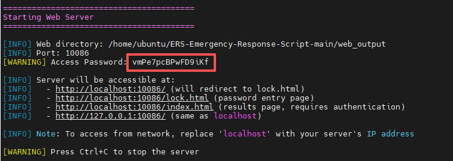
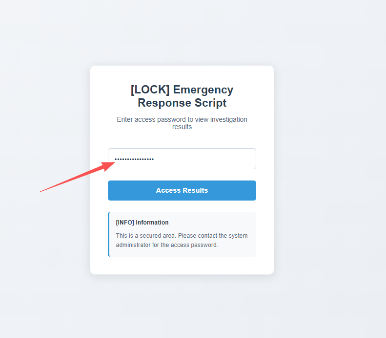
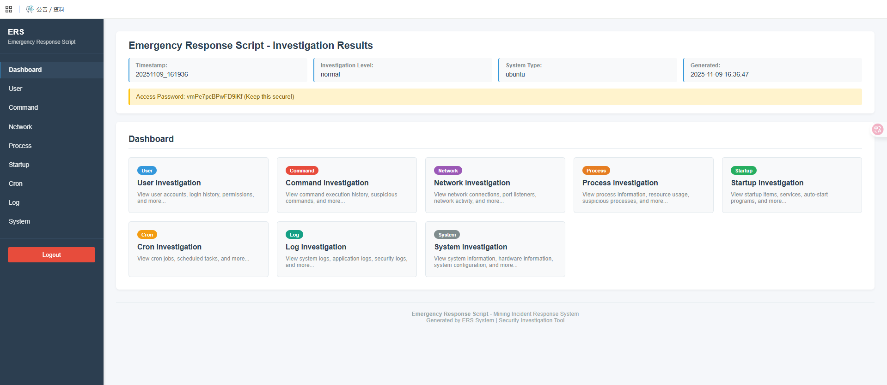
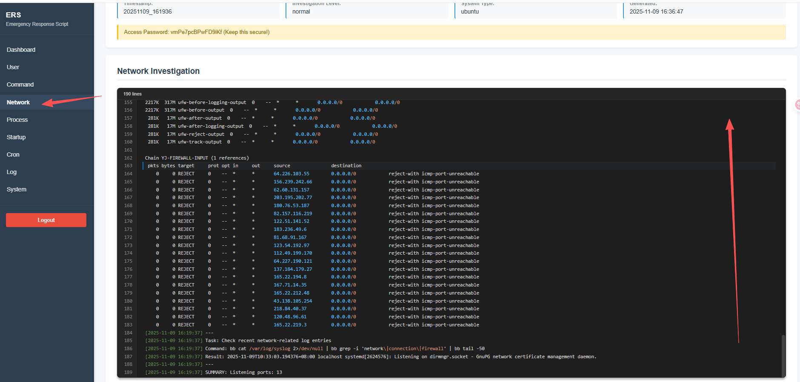

# 挖矿事件响应脚本 (Mining Incident Response Script)

一个专为Ubuntu系统设计的挖矿事件响应脚本，用于快速检测和分析可能的挖矿恶意软件活动。

## v2.0.0重构版本特性：
 - 懒得敲诸多命令，记录过多了之后会导致日志文件过大 -> 引入色彩提示和信息搜集等级，根据等级来决定检测的强度；
- 在排查中经常发现原生系统命令被篡改，原生命令不可信 -> 新版本依赖busybox静态编译包进行重构，即开即用；
- 原始的web简单利用Python-flask做了一个原型验证，未考虑最基本的安全因素 -> 使用busybox原生的http服务器并且每一次运行都会生成随机访问密码，并通过bash将这个密码给用户看！
- 内网环境中有一些主机不允许与外网访问，本身没有Python环境及其其他依赖环境 -> 使用busybox原生的http服务器实现；


## 文件结构

```
ERS/
├── start_mining_incident_response.sh    # 主脚本
├── start_web_viewer.sh           # Linux Web查看器启动脚本
├── modules/                       # 调查模块
│   ├── user_investigation.sh     # 用户调查
│   ├── command_investigation.sh  # 命令调查
│   ├── network_investigation.sh  # 网络调查
│   ├── process_investigation.sh  # 进程调查
│   ├── startup_investigation.sh  # 启动项调查
│   ├── cron_investigation.sh     # 计划任务调查
│   ├── log_investigation.sh      # 日志调查
│   └── system_investigation.sh   # 系统调查
├── results/                       # 结果目录
│   ├── user_YYYYMMDD_HHMMSS.log  # 用户调查日志
│   ├── process_YYYYMMDD_HHMMSS.log # 进程调查日志
│   ├── network_YYYYMMDD_HHMMSS.log # 网络调查日志
│   ├── command_YYYYMMDD_HHMMSS.log # 命令调查日志
│   ├── startup_YYYYMMDD_HHMMSS.log # 启动项调查日志
│   ├── cron_YYYYMMDD_HHMMSS.log    # 计划任务调查日志
│   ├── log_YYYYMMDD_HHMMSS.log     # 日志调查日志
│   ├── system_YYYYMMDD_HHMMSS.log  # 系统调查日志
│   ├── summary_YYYYMMDD_HHMMSS.txt # 摘要报告
│   └── results_index_YYYYMMDD_HHMMSS.txt # 结果索引
├── templates/                     # Web模板
│   ├── index.html                # 主页面模板
│   ├── lock.html                 # 认证页面模板
│   └── css/                      # 样式文件
│       ├── index.css             # 主页面样式
│       └── lock.css              # 认证页面样式
├── utils/                         # 工具栏目
│   └── utils.sh                   # 工具页
├── config.sh                      # 配置文件
├── web_output/                    # Web输出目录（自动生成）
│   ├── logs/                     # 日志文件目录
│   ├── css/                      # 样式文件目录
│   ├── index.html                # 生成的首页
│   └── lock.html                 # 生成的认证页
└── README.md                     # 说明文档
```


## 简要说明

- 编辑 `config.sh` 文件，修改 `INVESTIGATION_LEVEL` 变量的值，分为三个等级minimal、normal、detailed，具体有说明，默认是normal
- 其中本项目内置的busybox的md5值为：ebce43017d2cb316ea45e08374de7315
- web端口默认是开在10086上的，防火墙之类的记得开这个端口，或者修改为其他有许可的端口

## 快速开始

### 使用方法

### 1. 运行信息搜集脚本（必须首先运行）

增加可执行权限：

```bash
sudo chmod +x start_mining_incident_response.sh start_web_viewer.sh
```

运行信息搜集脚本

```bash
sudo ./start_mining_incident_response.sh
```

### 2. 使用Web查看器（可选，在运行调查脚本后使用）

```bash
# 启动Web查看器
sudo ./start_web_viewer.sh
```

启动后，脚本会显示一个**随机访问密码**，请复制保存。然后在浏览器中访问：

- 本地访问: `http://localhost:10086` (默认端口)
- 网络访问: `http://<服务器IP>:10086`



简陋的主看板，没啥用：


具体项：有基本时间、运行的命令、运行的结果等等....


## future
更多检查项目可以自行添加，想要整一个稍微完整的检查命令集、不是泛泛的那种，或者针对性的搜集信息。

## 许可证

MIT License

## 免责声明

此脚本仅用于教育和安全研究目的。使用者需要确保在合法授权的系统上运行。作者不对任何滥用行为负责。 